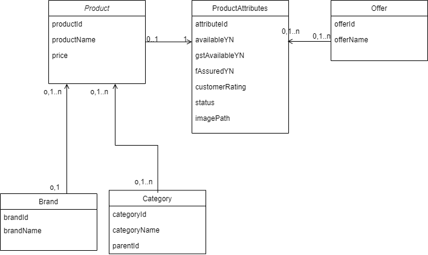
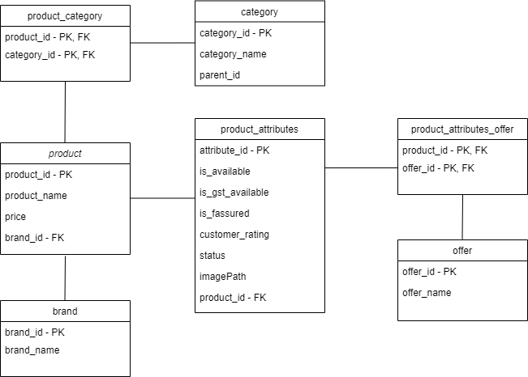

# Product Filter:

### Built With:

* Java 8
* Spring Boot
* MS SQL Server

### Class Diagram:

### Database Diagram:

### REST APIS:

* Filtered products (Fetch list of products based on provided filter criterias): (http://localhost:8080/api/v1/flipkart/products?rootCategoryId=1&minPrice=10000&maxPrice=90000&fAssuredYN=true&availabileYN=true&brands=1,2,3&offers=&gstInvoiceAvailableYN=true&minRating=3)
* Clear All Filter (Fetch list of products based on category): (http://localhost:8080/api/v1/flipkart/products/clearAll?categoryId=1)
* Categories (Fetch list of categories/it's sub-categories based on category): (http://localhost:8080/api/v1/flipkart/categories?categoryId=1)
* Brands (Fetch list of brands based on category): (http://localhost:8080/api/v1/flipkart/brands?categoryId=3)

### TODO and Improvements:

- [ ] Add FrontEnd
